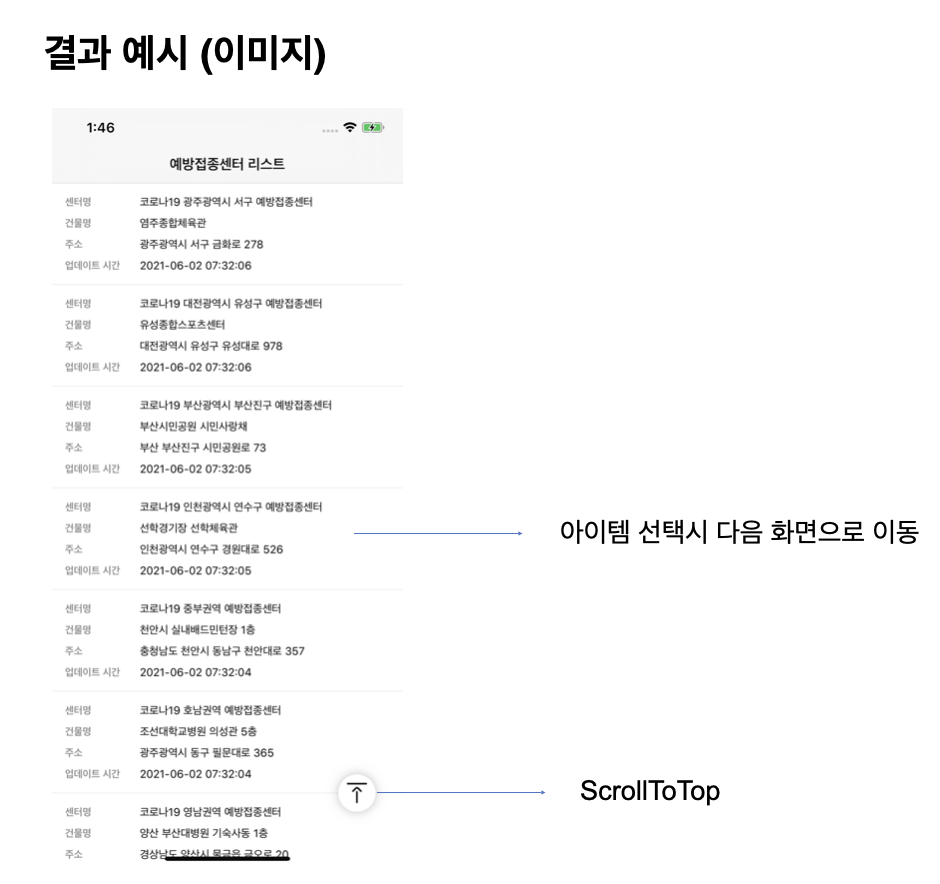
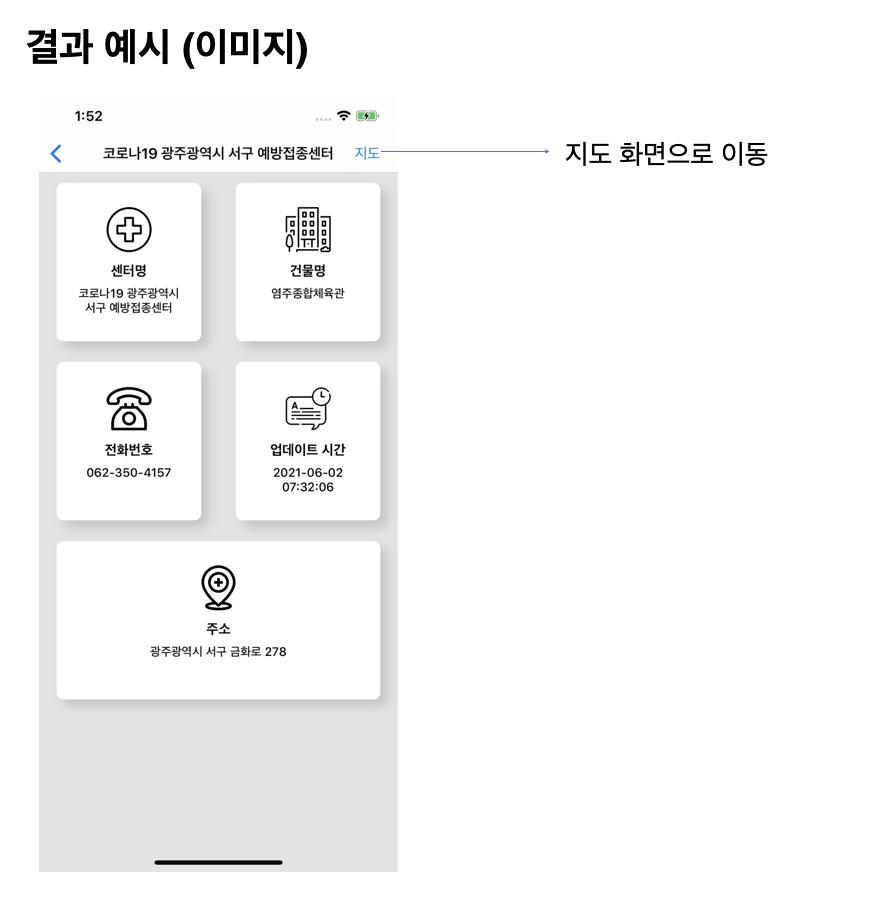
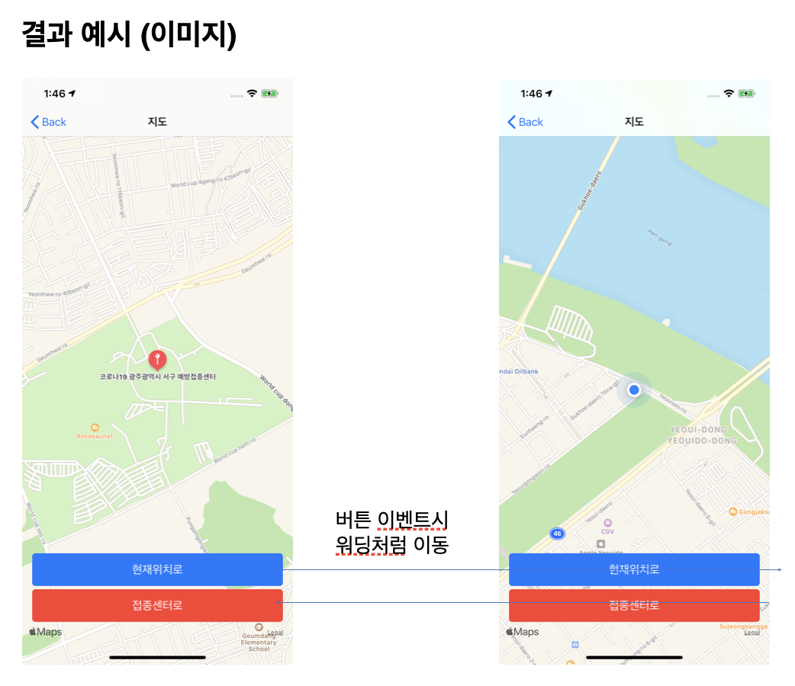
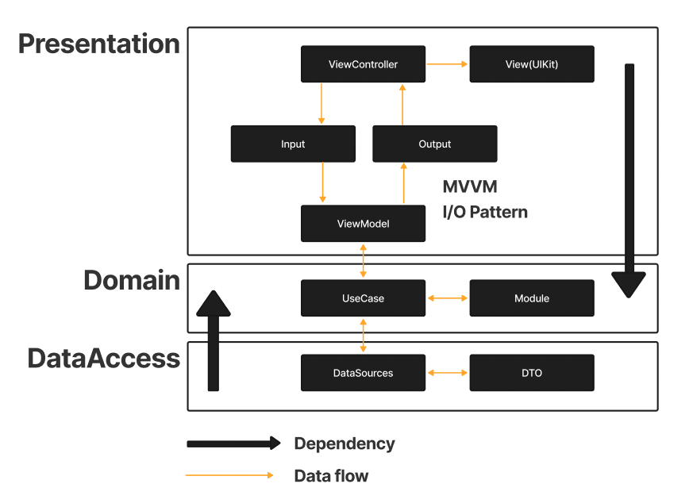

# COVID-19 Vaccination Center

  <p>
    
    
    
  </p>

  ## Requirements
  - 라이브러리는 필수 라이브러리 제외하고 자유롭게 사용 가능
  - 필수 라이브러리: Snapkit, MapKit, RxSwift, RxCocoa
  - 디자인패턴: MVVM
  - 제공된 API를 사용하여 JSON 데이터를 요청 후 리스트 형식으로 출력
  - 하단으로 스크롤시 자동으로 다음페이지 요청 (페이지당 10개씩) ”updateAt”를 기준으로 내림차순 리스트 정렬
  - 생성된 리스트에서 하나의 아이템을 선택하면 디테일 화면으로 이동 디테일 화면에서는 선택한 아이템의 정보를 출력
  - 지도에서는 현재 위치 오버레이와 접종센터 마커를 노출

---

  ## Useage
  ```
  $ pod install && xed .
  ```
  Project Root directory에서 pod install 실행 후 Pods.xcodeproj의 의존성이 있는 COVID-19-vaccination-center.xcworkspace를 실행하여 프로젝트를 실행합니다. 

    
  ## Libraries
  |Name|Description|
  |---|---|
  |SnapKit|Auto Layout을 쉽게 만듭니다.|
  |RxSwift|관찰 가능한 시퀀스를 사용하여 비동기 및 이벤트 기반 프로그램을 구성하기 위한 라이브러리입니다.|
  |RxCocoa|Cocoa Framework에 Rx기능을 합친 RxSwift 래퍼 입니다.|
  |RxCoreLocation|Core Location에 Rx기능을 합친 RxSwift 래퍼 입니다|
  |RxMKMapView|MapKit에 Rx기능을 합친 RxSwift 래퍼 입니다.|
  |RxTest|RxSwift의 스트림들을 테스트 할 수 있고 가상 시간을 함께 이벤트를 발생시킬 수 있도록 합니다.|
  |RxNimble/RxTest|Nimble의 expect라는 함수로 명료하게 테스트를 할 수 있도록 합니다.|

  > RxTest, RxNimble은 Project의 Tests target에서만 사용(import) 할 수 있도록 pod file에 명시합니다.
 
  ## Project

  

  *CleanArchitecture + MVVM(I/O pattern)*

  ### Presentation Layer
  - View, ViewModel이 포함되며 ViewModel의 Input Output을 통해 ViewController와 상호작용합니다.
  
  ### Domain Layer
  - 가장 안쪽의 Layer로 외부 Layer의 구현을 모르는 순수한 Business logic(Domain UseCase, Entities)가 포함됩니다.

  ### DataAccess Layer
  - Domain UseCase의 실질적인 Implementation가 존재하며 하나 이상의 Repositories 포함됩니다.

  ### etc..

   ### App
   - App의 시작점인 @main, Project Resourcesr가 포함됩니다.
   
   ### Utils 
   - Assets과 연결된 Namespace, Extension등이 포함됩니다.

   ### Infrastructure
   - Network통신을 위한 Implementation가 포함됩니다.

  ## Tree

```
COVID-19-vaccination-center
├── App
│   ├── AppDelegate.swift
│   └── Resources
│       ├── Assets.xcassets
│       │   ├── AccentColor.colorset
│       │   │   └── Contents.json
│       │   ├── AppIcon.appiconset
│       │   │   └── Contents.json
│       │   ├── Contents.json
│       │   ├── colors
│       │   │   ├── Contents.json
│       │   │   ├── blue.colorset
│       │   │   │   └── Contents.json
│       │   │   ├── gray.colorset
│       │   │   │   └── Contents.json
│       │   │   └── red.colorset
│       │   │       └── Contents.json
│       │   └── images
│       │       ├── Contents.json
│       │       ├── building.imageset
│       │       │   ├── Contents.json
│       │       │   └── building.png
│       │       ├── chat.imageset
│       │       │   ├── Contents.json
│       │       │   └── chat.png
│       │       ├── hospital.imageset
│       │       │   ├── Contents.json
│       │       │   └── hospital.png
│       │       ├── placeholder.imageset
│       │       │   ├── Contents.json
│       │       │   └── placeholder.png
│       │       ├── telephone.imageset
│       │       │   ├── Contents.json
│       │       │   └── telephone.png
│       │       └── top-alignment.imageset
│       │           ├── Contents.json
│       │           └── top-alignment.png
│       ├── Base.lproj
│       │   └── LaunchScreen.storyboard
│       └── Info.plist
├── DataAccess
│   └── VaccinationCenter
│       ├── DataSource
│       │   └── VaccinationCenterImpl.swift
│       ├── Entities
│       │   ├── CenterDTO.swift
│       │   └── CenterListDTO.swift
│       ├── Mock
│       │   └── VaccinationCenterMock.swift
│       └── Translator
│           └── CenterTranslator.swift
├── Domain
│   └── VaccinationCenter
│       ├── Entities
│       │   └── Center.swift
│       └── Usecase
│           └── VaccinationCenter.swift
├── Infrastructure
│   └── Network
│       ├── APIClient
│       │   └── APIClient.swift
│       ├── HTTPMethod.swift
│       └── RequestBuilder
│           └── RequestBuilder.swift
├── Presentation
│   ├── View
│   │   ├── Cell
│   │   │   └── CenterCell.swift
│   │   └── CustomVIew
│   │       └── ItemInfoView.swift
│   ├── ViewController
│   │   ├── VaccinationCenterDetailVC.swift
│   │   ├── VaccinationCenterMapVC.swift
│   │   └── VaccinationCenterVC.swift
│   └── ViewModel
│       └── VaccinationCenterVM.swift
└── Utils
    ├── Extension.swift
    └── Namespace.swift
```
